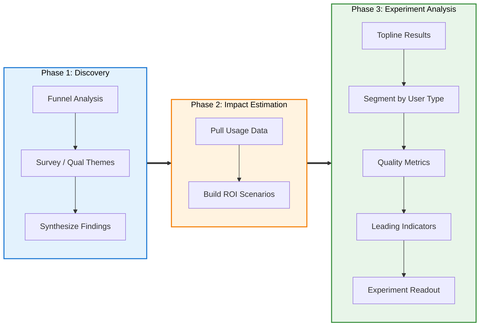

# Prompt Library: Data Analysis

## Workflow



---

## Phase 1: Discovery

### Funnel Analysis

```
Review @[funnel-data.csv] and analyze it to find where users are dropping off
in the activation flow. Count users at each stage, calculate completion rates,
identify the biggest drop-off point, and explain what it means.
```

### Survey / Qualitative Theme Extraction

```
Review @[survey-responses.csv] and extract the top themes explaining why users
drop off at [specific stage]. Group by the [feature_request/feedback] field,
count frequency and percentages, and include 2-3 representative quotes from
the [open-text field].
```

### Segmented Survey Analysis

```
Analyze @[survey-responses.csv] and break down the top themes by [segment field]
(e.g. company_size, plan_type). Show whether different segments have different
primary pain points.
```

### Synthesize Discovery Findings

```
Create [filename].md that synthesizes the funnel data, survey insights, and
proposed solution. Include sections for: Problem Statement, Quantitative
Evidence, Qualitative Evidence, Segmentation, Proposed Solution, and
Expected Outcome. Make it executive-ready.
```

---

## Phase 2: Impact Estimation

### Pull Baseline Metrics

```
Review @[usage-data.csv] and extract the key inputs for impact estimation:
monthly signups, baseline activation rate, average LTV, engineering cost
per month. Present as a table with source notes.
```

### Build ROI Scenarios

```
Use @[usage-data.csv] and @impact-estimation.md to build three ROI scenarios
(pessimistic, realistic, optimistic) for the [feature name]. Include key
assumptions, adoption rates, expected lift, 3-year revenue impact, and ROI
vs engineering investment. Save as [filename].md.
```

---

## Phase 3: Experiment Analysis

### Topline Results

```
Use @[experiment-results.csv] and analyze it to compare control vs treatment
[primary metric] rates with statistical significance. Show the lift in
percentage points and compare to our projected scenario.
```

### Segment by User Type

```
Segment the experiment results in @[experiment-results.csv] by [segment field]
to see if [target segment] had different outcomes than [other segments].
Show control vs treatment rates and lift for each segment.
```

### Quality Metrics (Activated Users Only)

```
Filter @[experiment-results.csv] to [converted/activated] users only and
compare [retention metric] and [engagement metric] between control and
treatment. Are we converting better users or just more users?
```

### Leading Indicators

```
From @[experiment-results.csv], compare [leading indicator 1] and
[leading indicator 2] rates between control and treatment. Do treatment
users show stronger signals for long-term success?
```

### Create Experiment Readout

```
Create [filename].md with the complete experiment analysis: executive summary,
topline results, segmentation by [segment], quality metrics, leading
indicators, recommendation (ship / ship to segment / iterate / kill), and
expected impact. Use @experiment-readout.md as the template.
```

---

## Tips

- Use `@filename.csv` to reference files in context.
- Ask for "formatted table" to get clean markdown output.
- **Chain analyses:** Run topline first → segment → quality → leading indicators. Each builds on the last.
- Each follow-up uses the same data file — no re-uploading.
- If the topline looks underwhelming, always segment before deciding to kill a feature.
