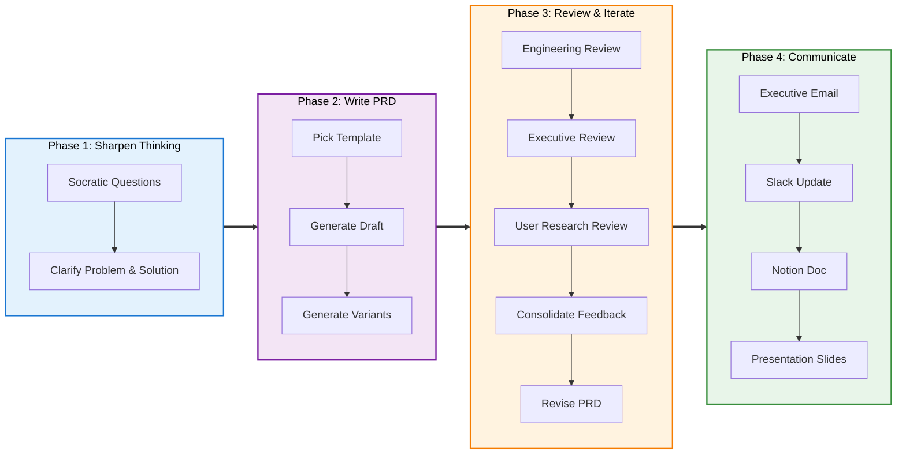

# Prompt Library: PRDs & Documentation

## Workflow



---

## Phase 1: Sharpen Thinking

### Socratic Questioning

```
Using @socratic-questioning.md, ask me 3-5 targeted questions to sharpen
my thinking on [feature/initiative]. Ask one question at a time and wait
for my answer before asking the next.
```

### Clarify Problem Statement

```
I'm considering building [feature]. Here's what I know:
- User pain: [description]
- Evidence: [data, quotes, tickets]
- Target users: [segment]

Help me write a clear, specific problem statement grounded in this evidence.
Then identify what assumptions I'm making that I should validate.
```

---

## Phase 2: Write PRD

### Generate PRD (Lightweight)

```
Using @prd-template-lenny.md, write a PRD for [feature name].

Context:
- Problem: [user pain point]
- Target users: [segment]
- Evidence: [data, research, quotes]
- Success metric: [what to move, by how much]
```

### Generate PRD (Detailed)

```
Using @prd-template-detailed.md, write a PRD for [feature name].

Context:
- Problem & opportunity: [description with evidence]
- High-level approach: [rough shape of the solution]
- Goals: [2-3 prioritized goals with metrics]
- Non-goals: [what we're explicitly not doing]
- Key flows: [user journey or steps]
```

### Generate Multiple Variants

```
Using @prd-template-lenny.md, write 3 different PRD drafts for [feature]
using the same inputs below. Vary the framing, scope, or approach so I
can compare and pick the strongest version.

Inputs:
- Problem: [pain point]
- Users: [segment]
- Evidence: [data]
```

---

## Phase 3: Review & Iterate

### Multi-Perspective Review

```
Review @[prd-filename].md from three perspectives and provide structured
feedback:

1. **Engineering** (using @reviewer-engineer.mdc): Technical feasibility,
   complexity, challenges, performance, recommendations.
2. **Executive** (using @reviewer-executive.mdc): Strategic alignment,
   business impact, resource justification, risks.
3. **User Research** (using @reviewer-user-researcher.mdc): User need
   validation, usability, adoption risks, research gaps.

Present each review separately with the reviewer's focus areas.
```

### Single-Perspective Deep Review

```
Using @reviewer-engineer.mdc (or @reviewer-executive.mdc or
@reviewer-user-researcher.mdc), do a deep review of @[prd-filename].md.
Organize feedback by the review structure in the persona file. Flag the
top 3 most critical issues.
```

### Consolidate Feedback

```
Here are the three reviews of my PRD:

[paste or reference the reviews]

Consolidate this feedback into a single prioritized list. Group by:
- Must-fix before shipping
- Should address if time allows
- Nice-to-have / future consideration

For each item, note which reviewer raised it and your recommendation.
```

### Revise PRD with Feedback

```
Update @[prd-filename].md to address the following feedback:

1. [Feedback item 1 — what to change]
2. [Feedback item 2 — what to change]
3. [Feedback item 3 — what to change]

Keep the existing structure; revise the relevant sections.
```

---

## Phase 4: Communicate

### Executive Email

```
Using @communication-styles.md, rewrite the key findings from
@[analysis-or-prd].md as an executive email. Use the 3-paragraph format:
Context → Insights → Recommendation. Keep it under 200 words.
```

### Slack Update

```
Using @communication-styles.md, write a Slack update summarizing
[what happened / decision made / key finding]. Keep it to 2-3 lines,
casual tone, with relevant emoji.
```

### Notion / Wiki Doc

```
Using @communication-styles.md, turn @[source-doc].md into a Notion-style
wiki page with Overview, Background, Key Findings (with subheaders),
Implications, Recommendations, and References. Write it for someone
reading 6 months from now.
```

### Presentation Slides

```
Using @presentation-action-titles.md and @[source-doc].md,
create [slides-filename].md with 12-15 slides using action titles
(McKinsey/BCG style). Each title is a declarative insight statement.
One idea per slide. Reading titles only should tell the full story.
```

---

## Tips

- **Phase 1 is optional but powerful.** Socratic questioning before writing a PRD catches weak thinking early.
- **Generate 2-3 PRD variants** and pick the best; it's faster than iterating on one draft.
- **Always run multi-perspective review** on important PRDs — engineer, exec, and user researcher catch different gaps.
- **Match the format to the audience:** Slack for the team, email for leadership, Notion for the record, slides for the meeting.
- **Chain the workflow:** Sharpen thinking → Write → Review → Revise → Communicate. Each phase feeds the next.
