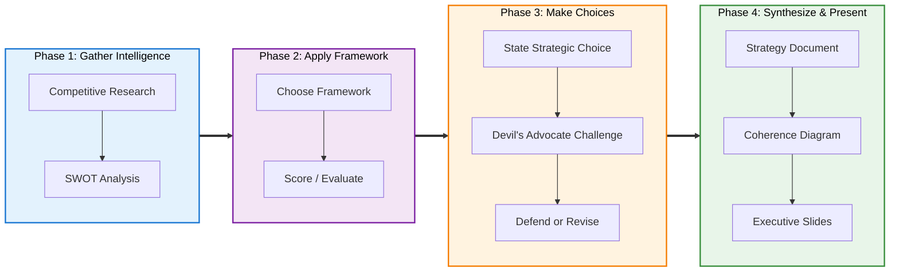

# Prompt Library: Product Strategy

## Workflow



---

## Phase 1: Gather Intelligence

### Competitive Research (Web Search)

```
Search the web for [Competitor 1], [Competitor 2], and [Competitor 3]'s
[AI/key] features, pricing strategies, and target markets. Then create
a competitive landscape comparison table.
```

### SWOT Analysis

```
Using @swot-analysis.md, create a SWOT analysis for [product/initiative].
Context: [brief situation — constraints, market, priorities].
Include top 3-5 items per quadrant with evidence, then map to
SO/ST/WO/WT strategies with a key recommendation.
```

---

## Phase 2: Apply Framework

### Rumelt's Strategy Kernel

```
Using @rumelt-strategy-kernel.md, help me structure a product strategy.
Here's my situation:
- Challenge: [what we're facing]
- Constraints: [team, budget, timeline]
- Target market: [who]

Walk me through Diagnosis, Guiding Policy, and Coherent Actions.
```

### DHM Feature Scoring

```
Using @gibson-biddle-dhm.md, score the following features on Delight,
Hard to Copy, and Margin-Enhancing (1-5 each):

1. [Feature A — brief description]
2. [Feature B — brief description]
3. [Feature C — brief description]

Present as a scorecard with total scores and priority recommendations.
```

---

## Phase 3: Make Choices

### State a Strategic Choice for Challenge

```
I've decided to [strategic choice] because [reasoning].

Using @devils-advocate.md, challenge this decision as hard as you can.
Attack from all 5 lenses: assumptions, risks, opportunity cost,
evidence, and alternatives.
```

### Socratic Questioning on a Decision

```
Using @socratic-questioning.md, ask me targeted questions to sharpen
my thinking on [decision/feature]. Ask one question at a time and
wait for my answer before the next.
```

### Defend or Revise After Challenge

```
Here's the devil's advocate challenge you raised: [summary of objections].

Here's my defense: [your response to each point].

Given this, should I stick with my choice, revise it, or consider
a different approach? What are the remaining risks?
```

---

## Phase 4: Synthesize & Present

### Create Strategy Document

```
Using @rumelt-strategy-kernel.md, create [filename].md organizing
my strategic choices into Diagnosis, Guiding Policy, and Coherent Actions.

My choices:
1. [Choice 1]
2. [Choice 2]
3. [Choice 3]
4. [Choice 4]
5. [Choice 5]

Include a coherence check at the end.
```

### Visualize Strategy Coherence

```
Create a Mermaid diagram showing how my 5 strategic choices connect
to the guiding policy and coherent actions. Show which choices
reinforce each other.
```

### Create Executive Slide Deck

```
Using @presentation-action-titles.md and @[strategy-doc].md,
create [slides-filename].md with 12-15 slides using action titles
(McKinsey/BCG style). Each title should be a declarative statement.
Reading only the titles should tell the full story.
```

---

## Tips

- Reference framework files with `@` for consistent application.
- **Run devil's advocate on every major decision** before committing.
- Use web search for competitive research, then synthesize into a doc.
- **Chain:** Competitive research → Framework → Choices + Devil's advocate → Strategy doc → Slides.
- When in doubt, ask for a Mermaid diagram to visualize how choices connect.
